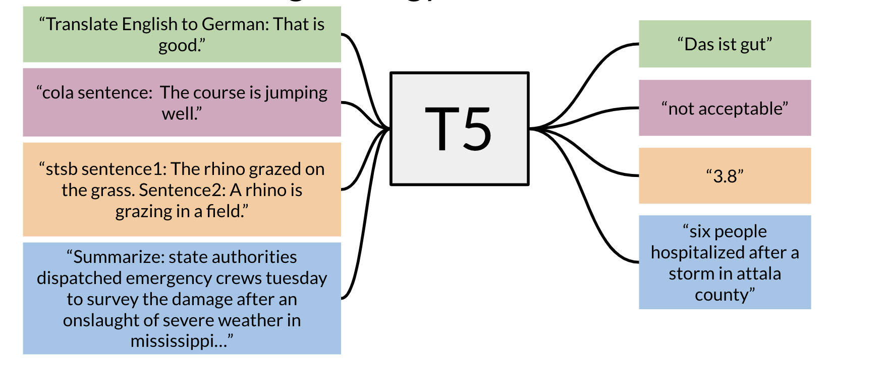

# Multi-Task Training Strategy

This is a reminder of how the T5 model works:

You can see that you only have to add a small prefix to the input and the model as a result will solve the task for you. There are many tasks that the t5 model can do for you.

It is possible to formulate most NLP tasks in a “text-to-text” format – that is, a task where the model is fed some text for context or conditioning and is then asked to produce some output text. This framework provides a consistent training objective both for pre-training and fine-tuning. Specifically, the model is trained with a maximum likelihood objective (using “teacher forcing” ) regardless of the task.

Training data strategies

**Examples-proportional mixing**: sample in proportion to the size of each task’s dataset

**Temperature scaled mixing**: adjust the “temperature” of the mixing rates. This temperature parameter allows you to weight certain examples more than others. To implement temperature scaling with temperature T, we raise each task’s mixing rate rm to the power of 1⁄T and renormalize the rates so that they sum to 1. When T = 1, this approach is equivalent to examples-proportional mixing and as T increases the proportions become closer to equal mixing

**Equal mixing**: In this case, you sample examples from each task with equal probability. Specifically, each example in each batch is sampled uniformly at random from one of the datasets you train on.

Fine tuning example

You can see above how fine tuning on a specific task could work even though you were pre-training on different tasks.

