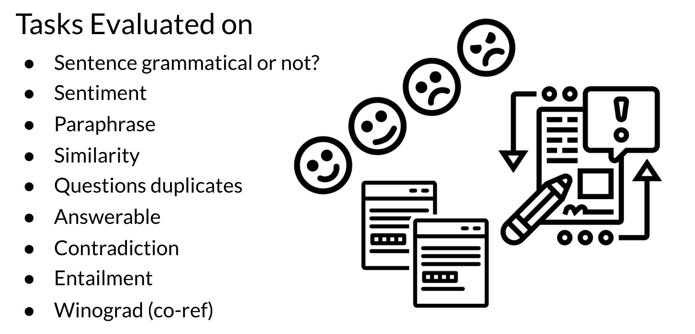

# GLUE Benchmark

General Language Understanding Evaluation (GLUE) is contains: 

* A collection used to train, evaluate, analyze natural language understanding systems
* Datasets with different genres, and of different sizes and difficulties
* Leaderboard

Currently T5 is state of the art according to this GLUE benchmark and  you will be implementing it for homework this week! This GLUE bench mark is used for research purposes, it is model agnostic, and relies on models that make use of transfer learning.