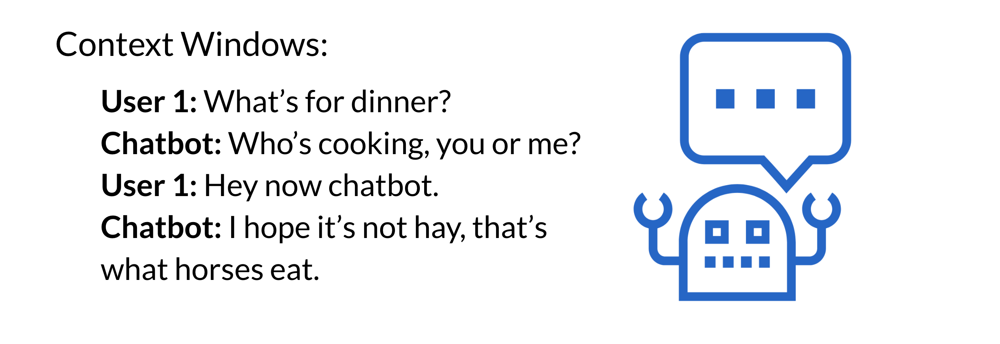

# Tasks with Long Sequences

Tasks that make use of long sequences include 

* Writing books 
* Storytelling
* Building intelligent agents for conversations like chatbots.

This week you will learn about the bottlenecks in these larger transformer models, and solutions you can use to make them trainable for you. You will also learn about the re-former model (AKA the reversible transformer). Here is what you will be building for your programming assignment: A chatbot! 

