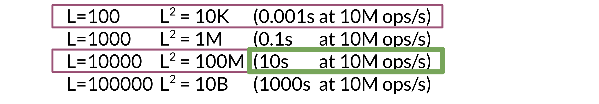
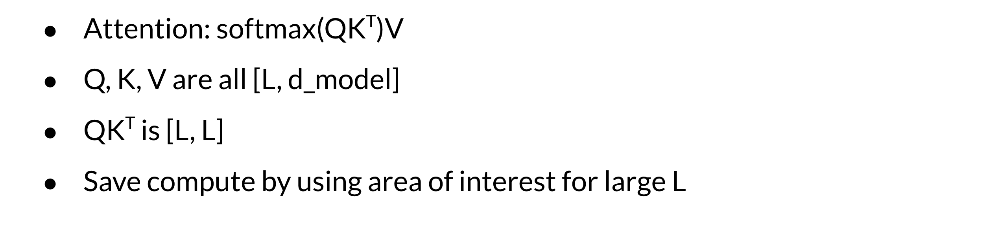

# Transformer Complexity

One of the biggest issues with the transformers is that it takes time and a lot of memory when training. Concretely here are the numbers. If you have a sequence of length L, then: 

So if you have N layers, that  means your model will take N times more time to complete. As L gets larger, the time quickly increases.  

When you are handling long sequences, you usually don't need to consider all L positions. You can just focus on an area of interest instead. For example, when translating a long text from one language to another, you don't need to consider every word at once. You can instead focus on a single word being translated, and those immediately around it, by using attention. 

To overcome the memory requirements you can recompute the activations. As long as you do it efficiently, you will be able to save a good amount of time and memory. You will learn this week how to do it. Instead of storing N layers, you will be able to recompute them when doing the back-propagation. That combined with local attention, will give you a much faster model that works at the same level as the transformer you learned about last week. 