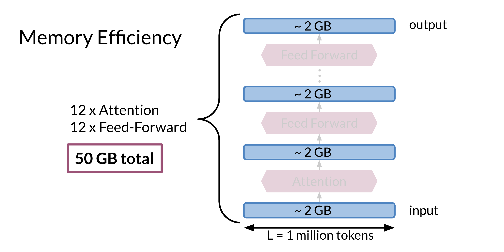

# Motivation for Reversible Layers: Memory!

Every time you run a forward propagation, you need to compute the back propagation to update the weights. The biggest issue with doing this is that you have to store the weights to be able to compute the back-prop. With these very large models, that could be a lot of memory. 

For example in the model above it requires 2GB to compute the Attention and 2GB for the feed forward. You have 12 layers for attention and 12 layers for the feedforward. That is equal to 12 * 2 + 12*2 + 2 (for the input) = 50 GB. That is a lot of memory. In the next video you will learn how to solve such problems.  