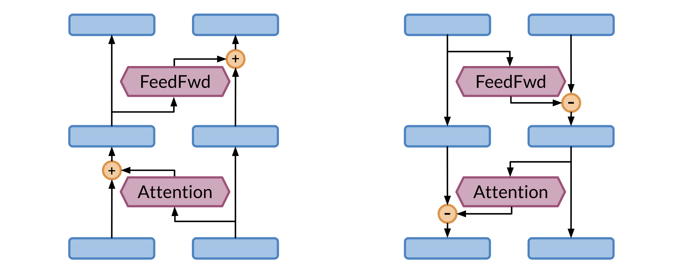
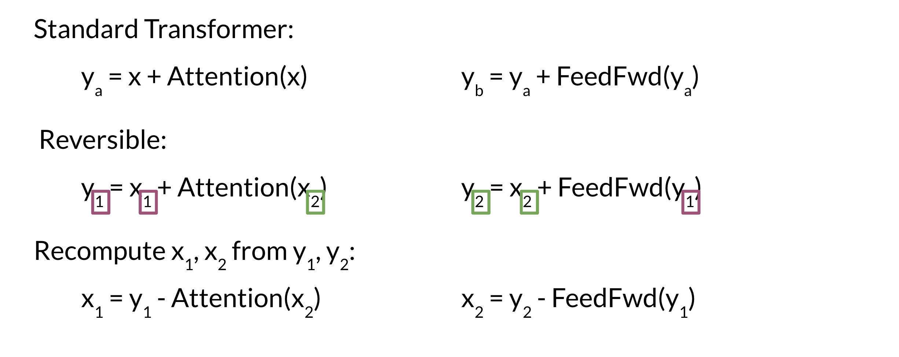
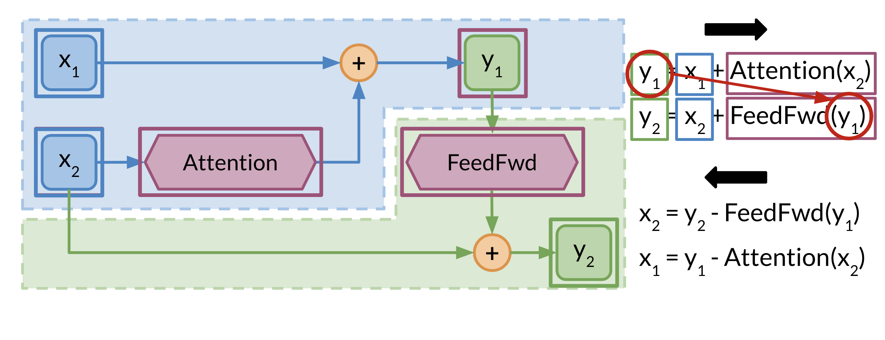

# Reversible Residual Layers

Reversible residual layers allow you to reconstruct the forward layer from the end of the network. Usually you have two similar branches in the network that you use to compute the network. 

In the left picture, you have the forward propagation. One side of the network is used as input and the other is used for the attention. In the left side, the same thing is happening but in the opposite direction. 

Take a few minutes and try to understand the equations above. You basically make use of the two branches of the network. When coming back for the back propagation, you only need the y's to compute x_2 and then you can use x_2 along with y_1 to compute x_1. Pretty neat! Now you don't have to store the weights, because you can just compute them from scratch. This image shows you a visualization of what is happening. 

