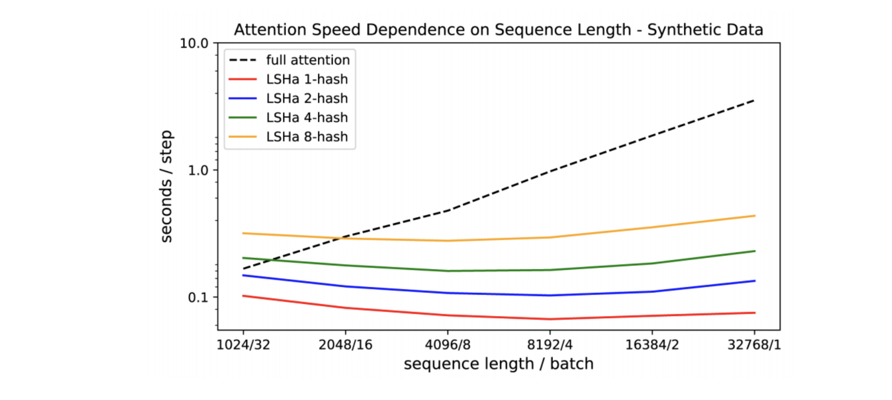

# Reformer

The reformer allows you to fit up to 1 million tokens on a single 16 gigabyte GPU. It is designed to handle context windows of up to 1 million words. It combines two techniques to solve the problems of attention and memory allocation which are bottlenecks for the transformer networks.

Reformer uses locality sensitive hashing, which you saw earlier in this specialization, to reduce the complexity of attending over long sequences. It also uses reversible residual layers to more efficiently use the memory available. In the picture below you can see how the reformer performs when compared to a normal full-attention model. 

